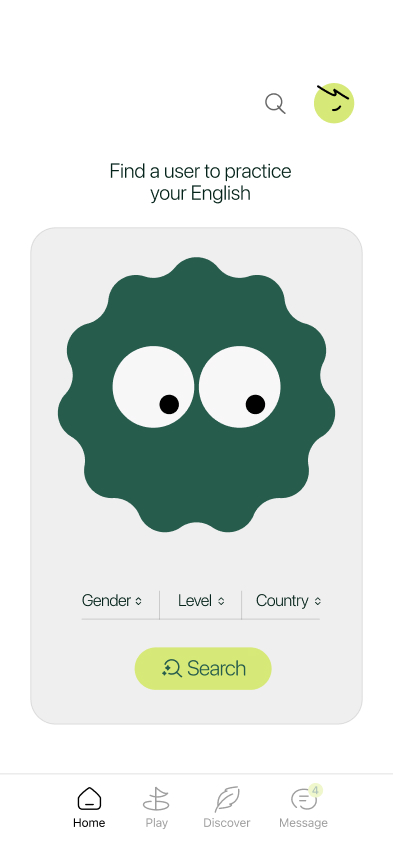

# EnglishJi - Real-time Audio Language Learning


**EnglishJi** is a production-grade iOS application designed to facilitate real-time English language practice through peer-to-peer audio calls. 

Built with a focus on **engineering excellence**, this project demonstrates advanced competency in **low-level systems programming**, **concurrency**, and **clean architecture**.

<p float="left">
  
  
  
  
</p>

---

## 🚀 Engineering Highlights

This codebase goes beyond standard UI development, solving complex problems in real-time communication and state management.

### 1. Robust Audio Session Management (`Core/Audio`)
Handling iOS audio sessions correctly is notoriously difficult. EnglishJi implements a dedicated **AudioSessionManager** that:
-   **Configures hardware-aligned I/O**: Forces 48kHz sample rates and 5ms buffer durations for ultra-low latency.
-   **Manages Interruptions**: Gracefully handles incoming phone calls (GSM) and Siri interruptions, auto-resuming the VoIP session when possible.
-   **Smart Routing**: Detects route changes (headphones unplugged) and seamlessly falls back to the speaker.
-   **Category Management**: Utilizes `AVAudioSession.Category.playAndRecord` with `.voiceChat` mode for optimal echo cancellation and side-tone suppression.

### 2. Thread-Safe Concurrency & State
-   **MainActor Isolation**: Critical UI state in `WebRTCManager` is isolated to the main thread, eliminating strict concurrency warnings and runtime crashes.
-   **Atomic Operations**: Connection state transitions (`Idle` -> `Searching` -> `Connected`) are guarded against race conditions, ensuring predictable behavior even during rapid user interactions.
-   **Memory Safety**: Rigorous use of `[weak self]` in async closures prevents retain cycles—crucial for long-lived signaling connections.

### 3. Modular "Core" Architecture
The app maps feature complexity to a clean directory structure, decoupling low-level drivers from the UI.

```text
EnglishJi/
├── Core/               # System-level logic (No UI dependencies)
│   ├── Audio/          # AudioSessionManager (AVFoundation)
│   ├── WebRTC/         # WebRTCManager & WebRTCClient (GoogleWebRTC)
│   └── Networking/     # SignalingClient (WebSocket/Starscream alternative)
├── ViewModel/          # MVVM Logic (ChatViewModel, etc.)
└── Views/              # Pure SwiftUI Views
```

### 4. Custom WebRTC Integration
Instead of relying on heavy third-party wrappers, EnglishJi interfaces directly with `GoogleWebRTC` for maximum control:
-   **Unified Plan SDP**: Modern SDP negotiation for future-proof compatibility.
-   **ICE Candidate Queuing**: Handles the common "race" where candidates arrive before the remote description is set.
-   **Stats Monitoring**: Real-time monitoring of RTT (Round Trip Time) and packet loss for debug overlays.

---

## 🛠 Tech Stack

-   **Language**: Swift 5.9
-   **UI Framework**: SwiftUI (with UIKit bridges for video rendering views)
-   **Architecture**: MVVM + Singleton Services (for strictly global hardware resources)
-   **Networking**: Native `URLSessionWebSocketTask` for signaling (no external socket deps).
-   **Real-time Media**: WebRTC (Google Binary)
-   **Dependencies**: Firebase (Auth/Analytics), GoogleSignIn.

---

## 🏃‍♂️ How to Run

### Prerequisites
-   Xcode 15+
-   Physical iPhone (Simulator does not support full Microphone/Audio Session routing).

### Setup
1.  **Clone the Repository**:
    ```bash
    git clone https://github.com/kirtidhwajpatra/EnglishJi.git
    cd EnglishJi
    ```
2.  **Dependencies**:
    -   Open `EnglishJi.xcodeproj`.
    -   Xcode Package Manager will automatically resolve `GoogleWebRTC` and `Firebase`.
3.  **Sign & Build**:
    -   Select your Development Team in "Signing & Capabilities".
    -   Build and Run on a **physical device**.

---

## 🔮 Future Improvements

-   **PushKit Integration**: To wake the app for incoming calls when terminated (VoIP Push).
-   **CallKit Integration**: To present the native system calling UI (Lock Screen integration).
-   **Unit Tests**: Adding XCTest coverage for the `SignalingClient` state machine.

---

## 👨‍💻 Author

**Kirtidhwaj Patra** - *Senior iOS Engineer*

*Built with passion for clean code and seamless user experiences.*
